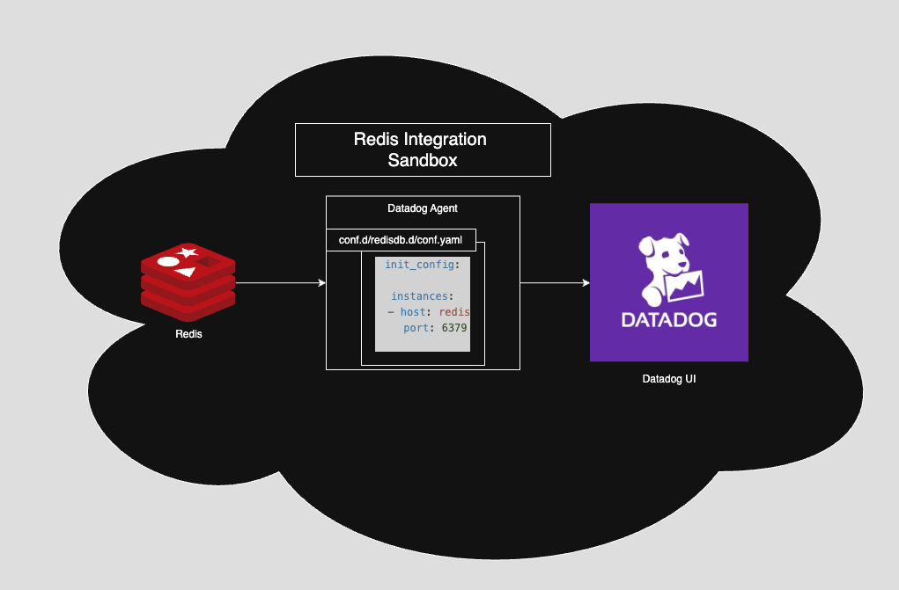
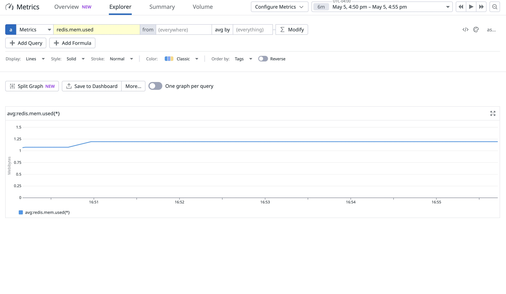

# Redis Integration Sandbox with Datadog 🧪

This project provides a lightweight sandbox for exploring and validating the [Redis integration](https://docs.datadoghq.com/integrations/redisdb/) with the Datadog Agent in a containerized environment.

---

## 🎯 Purpose

- Learn how Datadog collects metrics from Redis
- Test and debug the Redis integration locally
- Visualize Redis metrics in the Datadog UI
- Safely experiment with real-time test data and tagging

---

## 🧱 Architecture




This project uses Docker Compose to launch:

- **Redis** – in-memory key-value store
- **Datadog Agent** – configured to collect metrics from Redis

```
Redis ↔ Datadog Agent ↔ Datadog Metrics Explorer
```

---

## 🚀 Getting Started

### 1. Prerequisites

- Docker and Docker Compose installed
- A valid Datadog API key

### 2. Setup

```bash
# Clone the repo
git clone https://github.com/your-username/redis-sandbox.git
cd redis-sandbox

# Copy and fill out your API key
cp .env.example .env
vim .env
```

```env
# .env
DD_API_KEY=your_datadog_api_key
```

> Your `.env` file is ignored in version control to protect your key.

### 3. Launch the Sandbox

```bash
docker compose up -d
```

---

## 🧪 Generate Test Data

```bash
chmod +x scripts/generate_test_data.sh
bash scripts/generate_test_data.sh
```

This simulates Redis activity using `SET`, `GET`, and `EXPIRE` operations so you can observe metrics like:

- `redis.net.commands`
- `redis.stats.keyspace_hits`
- `redis.mem.used`
- `redis.expires`

---

## 📊 How to Validate

### In Datadog:

1. Visit [Metrics Explorer](https://app.datadoghq.com/metric/explorer)
2. Search for metrics beginning with `redis.`
3. Filter by the tag `env:redis_sandbox`

📸 Example metric visible in Datadog:



### Or use the Agent directly:

```bash
docker exec -it datadog-agent agent status
```

---

## 📁 Project Structure

| File/Folder              | Purpose                                       |
|--------------------------|-----------------------------------------------|
| `docker-compose.yml`     | Defines Redis and Datadog Agent containers    |
| `conf.d/redisdb.d/`      | Redis integration config for the Agent        |
| `scripts/`               | Test data generator for Redis                 |
| `.env.example`           | Template for local API key config             |
| `assets/redis_diagram.png` | Architecture diagram for README             |
| `assets/redis_mem_used.jpg` | Screenshot of Redis metric in Datadog UI   |

---

## 🏷️ Tagging Convention

The containers are tagged with:

```bash
DD_TAGS="env:redis_sandbox service:redis-integration"
```

You can customize these in the `.env` file.

---

## 🧠 Notes

- This sandbox is for **testing and learning**, not production use.
- Metrics will appear in Datadog as soon as Redis activity is detected.
- The Agent configuration is defined via mounted `conf.d` files.

---

## 📚 Resources

- [Redis Integration Docs](https://docs.datadoghq.com/integrations/redisdb/)
- [Docker Integration Docs](https://docs.datadoghq.com/containers/docker/)
- [Agent Configuration Reference](https://docs.datadoghq.com/agent/guide/agent-configuration-files/)

---

## 👤 Author

Created by Vince Allen to support Redis monitoring education, integration testing, and Datadog troubleshooting.
